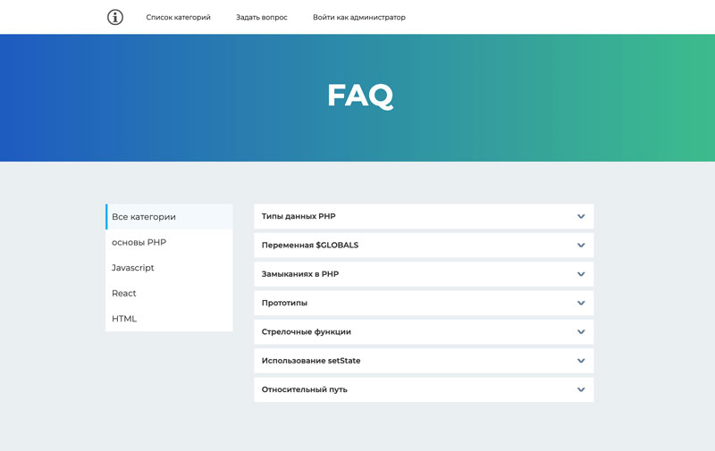

<h2>Дипломная работа по курсу «PHP/SQL: back-end разработка и базы данных»</h2>

Разработан типовой сервис вопросов и ответов. Pеализована клиентская часть сервиса и интерфейс администратора.

<h3>Клиентская часть</h3>

- Пользователи могут просматривать категории, вопросы и ответы.
- Любой пользователь может задать вопрос, указав своё имя, адрес электронной почты, выбрав категорию и написав текст вопроса.
