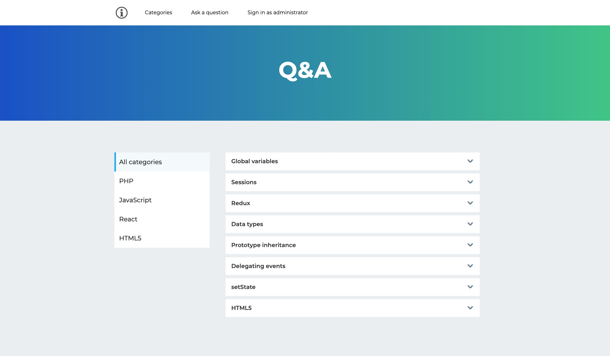
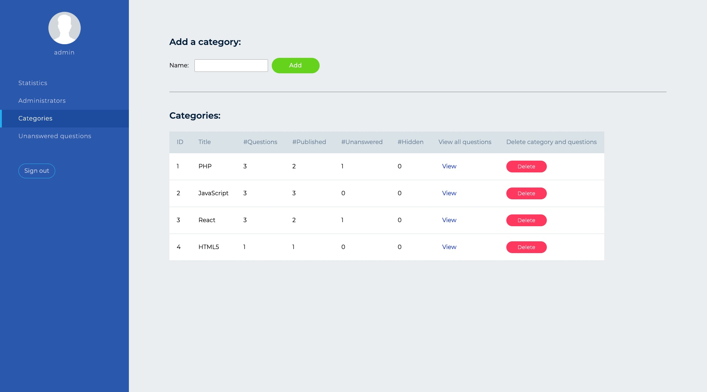
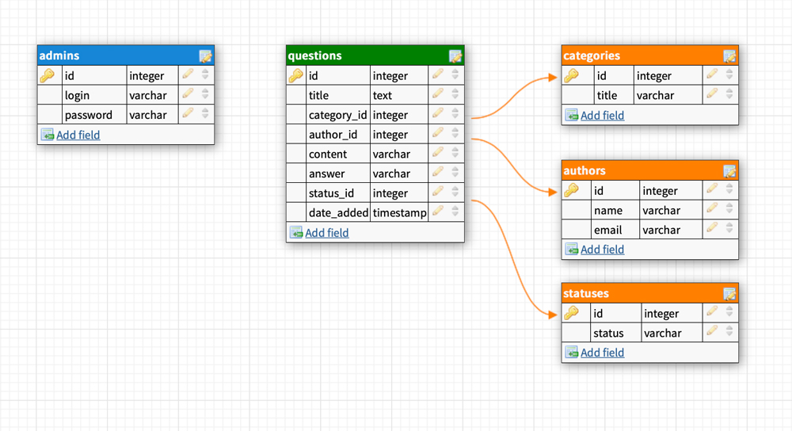

## QA-WebApp: Featuring PHP, SQL, MVC and HTML5

+ Question and answer web application with guest and administrator portals.
+ The system is implemented in PHP, using MVC architecture, components are implemented using OOP, data is stored in a relational database.
+ [Guest portal](https://natalia-qa-webapp.herokuapp.com/index.php?c=front&a=categories&categoryId=all)
+ [Administrator portal](https://natalia-qa-webapp.herokuapp.com/index.php) (username: admin, password: admin)

### Guest portal

+ Users can browse categories, questions and answers.
+ Any user can ask a question by entering their name, email address, selecting a category and writing the text of the question.

### Administrator portal

+ A login and password must be entered to access the administrator interface.
+ By default, a single administrator with username admin and password admin is created.
+ General section: the number of questions in each category, the number of unanswered questions and the number of administrators
+ Administrator section: a list of administrators with the ability to remove or change the password, and add a new administrator
+ Categories: a list of categories, the total number of questions in each category, published, unanswered and hidden. You can view all questions within a thread, delete a category with questions and add a new category.
+ Unanswered Questions: a list of unanswered questions, it is possible to delete, change status and edit
+ Edit question: change the category, author name, question title, question content, answer to the question. Possibility to publish on the website or hide the question

### Installation instructions
+ Make a clone of the repository.
+ Put the contents of the folder on your server.
+ Load data from dump.sql into the database.
+ In the config.php file specify database name, login and password.

### UML diagram of the database
